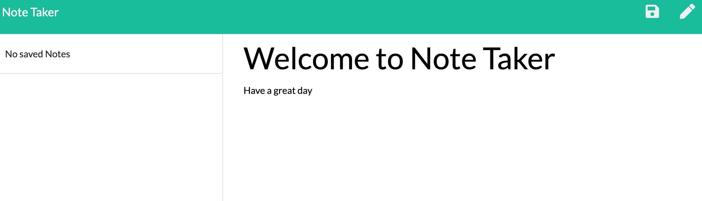

# Express Note Taker ©2021 

## Description
Express Note Taker is a tool made to organize, update and deleted tasks in the browser.  

Project by: Aimee J  
Main Github: [MissAimeeJay](https://github.com/MissAimeeJay)
Repository Link: https://github.com/MissAimeeJay/Express-Note-Taker  
Live Page Url:  
[https://express-note-takr.herokuapp.com/](https://express-note-takr.herokuapp.com/)

## Table of Contents

* [Installation](#installation)
* [Usage](#usage)
* [License](#license)
* [Testing](#testing)
* [Questions](#questions)

## Installation
The project should not require installing any dependencies as a heroku link has been provided to use.

## Usage 
This web application can be used to schedule any task.  Once the task has been completed, it can be deleted from the task list side bar.

## License
[Click here for more information on this license](https://choosealicense.com/licenses/unlicense)

## Testing
Note that the tasks entered will not enter the side bar until the save icon has been clicked.  The save icon will only appear when text has been entered into the fields.

## Questions
If you have questions or would like to contact for other reasons, please contact
Aimee J  
Email: ajesso@post.com
Main Github: [MissAimeeJay](https://github.com/MissAimeeJay)